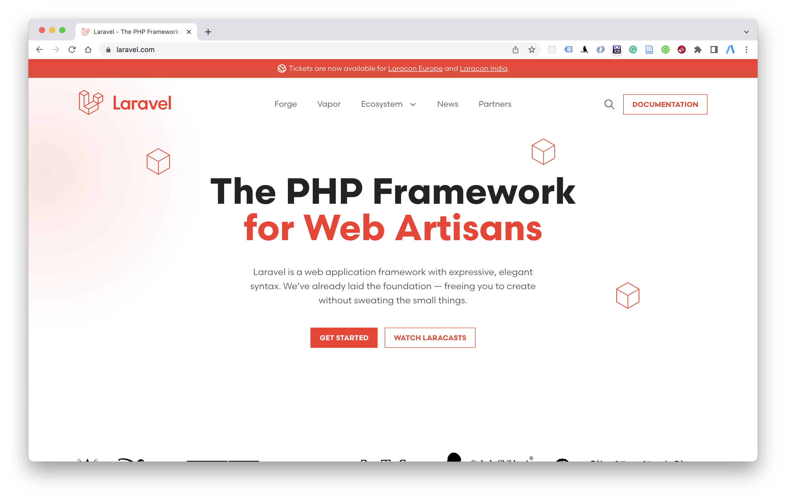
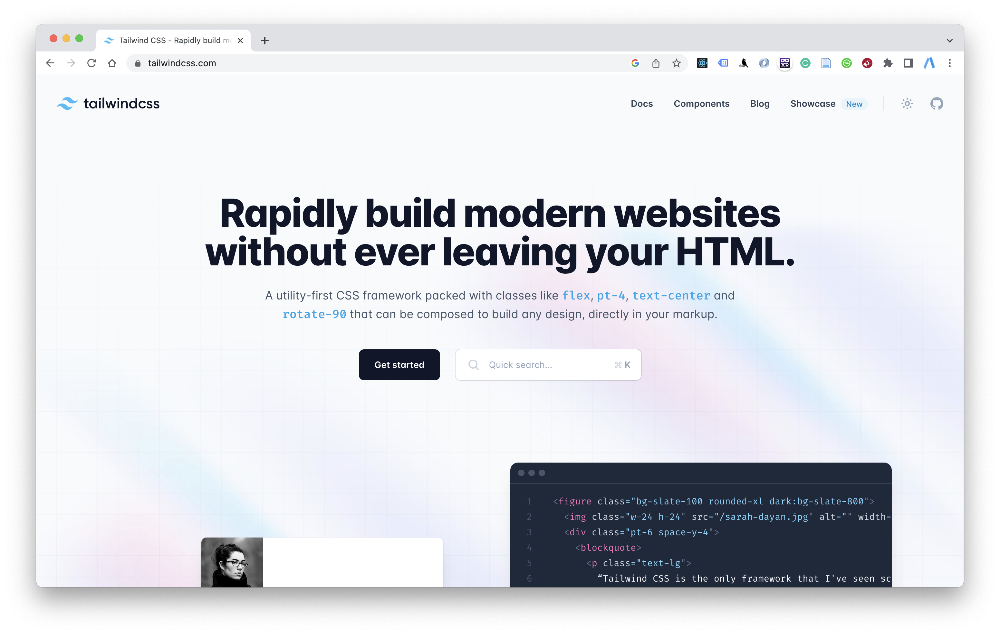
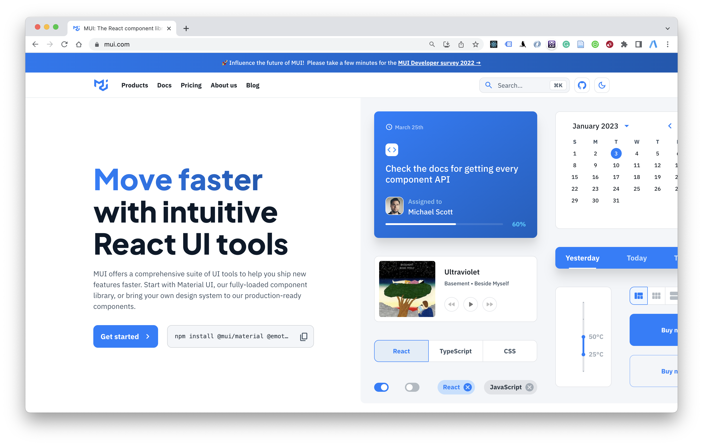

# State of the art web development

This is some notes about my experience and research on web development.

State of the art mean the latest, cost effective, trends.

I divide State of The Art (SOTA) into few category that divide the kind of web you want to build:

## Landing Page, Information Page, Blog

Characteristic:

- You want just simple web,
- Few amazing web front-end
- Few creativity.
- Cheap

Use:

- Wordpress
- Shopify
- Blogger

## Web Application

Characteristic:

- High Costumization
- High Creativity
- High Skill
- High Cost
- Data Processing

Use:

### React js

With massive adaption in this framework, available alot of NPM library to help your development.

### Typescript

For knowing what data type (integer,string,etc..) variable in javacript.

### React Three js

[@react-three/fiber](https://github.com/pmndrs/react-three-fiber)

Animation and 3D object on the web is required these days. user will leave your website if in first 5 seconds interaction with your website not make user impressed. boring website.

How about heavy load? 3D and animation require large js and 3d assets. but in this era 4G it doesn't matter.
or you can using lazy load technic. using [react lazy and suspense](https://reactjs.org/docs/react-api.html#reactlazy)

### Laravel

PHP not die, Laravel keep updating. per six months comes with latest development methodology.

### Tailwind

This is famous css framework

### Material UI

If you don't want wasting your time about UI or making react atomic component by yourself. just try [Material UI](https://mui.com/)

From MUI description:

> MUI offers a comprehensive suite of UI tools to help you ship new features faster. Start with Material UI, our fully-loaded component library, or bring your own design system to our production-ready components.

 
 

## Trends (2023)

**Glass Transparent Effect**, Will make the ui fresh

**Soft gradient background**, Represent fresh, fun, Artificial Intelligence.

**Micro animation**, Make every detail in the app cool

**3D web**, Imersive
